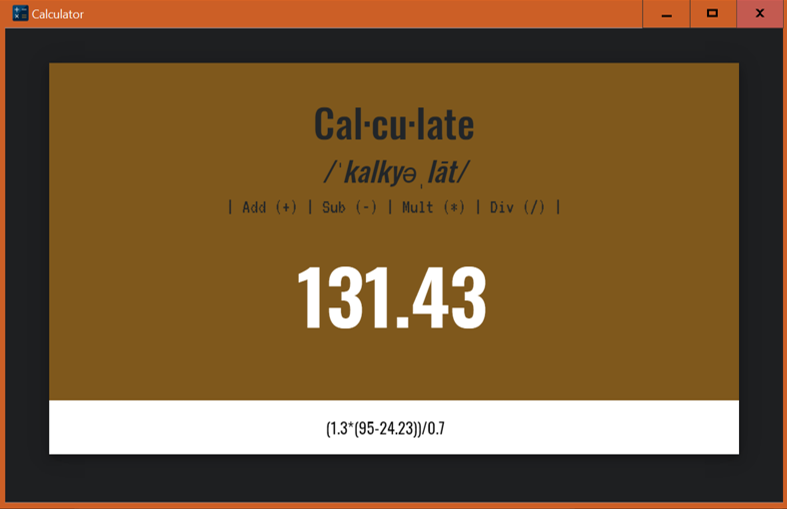

# e-PyCalc
>  A Python-based calculator with a Electron cross-platform GUI

### Prerequisites

* Python 3.6/2.7
* Latest version of Node.js

## Built With

* [Electron](https://electronjs.org/docs) - The web framework used
* [Python-Shell](https://www.npmjs.com/package/python-shell) - For communication with Python Files
* [NPM](https://www.npmjs.com/) - Used for general development

## Authors

* **Steven Samuel** - *Initial work* - [SPS Vision](https://spsvision.com/?gi=72a7d149e9f1)

See also the list of [contributors](https://github.com/your/project/contributors) who participated in this project.

## License

This project is licensed under the MIT License - see the [LICENSE.md](LICENSE.md) file for details

## Acknowledgments

* Hat tip to anyone whose code was used
* Inspiration
* etc
